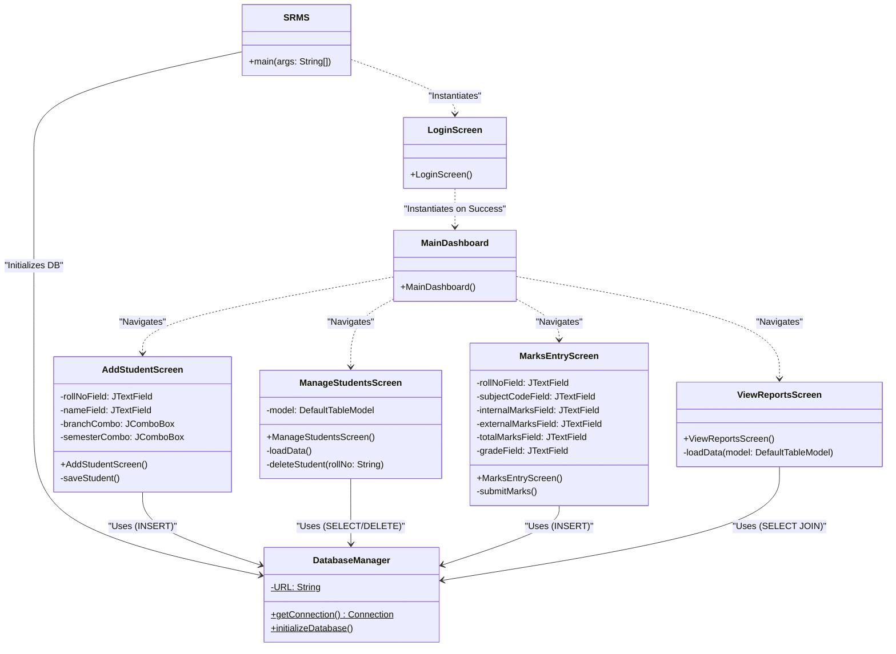
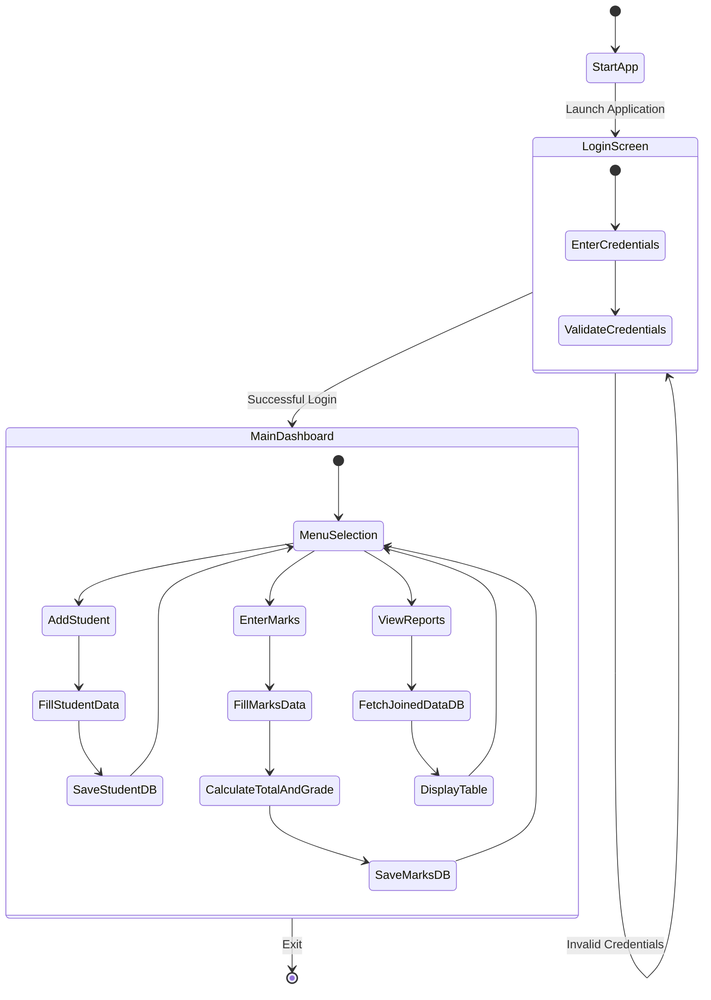

# SRMS UML Diagrams

This document contains the structural and behavioral UML diagrams for the Student Result Management System (SRMS). 
These diagrams use Mermaid.js syntax, which can be rendered directly in most Markdown viewers (including GitHub).

---

## 1. Use Case Diagram
This diagram shows the interactions between the system's users (Actors) and the functionalities (Use Cases) it provides.

```mermaid
usecaseDiagram
    actor Administrator as "Administrator / Faculty"

    package "Student Result Management System" {
        usecase UC1 as "Secure Login"
        usecase UC2 as "Add New Student"
        usecase UC3 as "Manage Students (View/Delete)"
        usecase UC4 as "Enter Subject Marks"
        usecase UC5 as "Auto-Calculate Results & Grades"
        usecase UC6 as "View Results / Report Cards"
    }

    Administrator --> UC1
    Administrator --> UC2
    Administrator --> UC3
    Administrator --> UC4
    Administrator --> UC6
    
    UC4 ..> UC5 : <<includes>>
```

---

## 2. Class Diagram
This diagram outlines the system's class structure, showing the primary UI components, the database manager, and their relationships.



---

## 3. Object Diagram
This diagram represents a snapshot of the instantiated objects at a specific moment in time (e.g., when the Admin is actively adding a student via the dashboard).

```mermaid
classDiagram
    %% Object Diagram simulated using Class Diagram syntax
    object SRMS_App {
        status = "Running"
    }
    
    object dbConnection : DatabaseManager {
        url = "jdbc:sqlite:srms.db"
        status = "Connected"
    }

    object mainScreen : MainDashboard {
        isVisible = true
    }

    object addScreen : AddStudentScreen {
        isVisible = true
        rollNoField = "1001"
        nameField = "John Doe"
        branchCombo = "Computer Science"
        semesterCombo = "3"
    }

    SRMS_App --> mainScreen : "Hosts"
    mainScreen --> addScreen : "Opened"
    addScreen --> dbConnection : "Sending Data"
```

---

## 4. Activity Diagram
This diagram shows the step-by-step workflow of a crucial process in the application: The workflow from logging in to successfully entering marks and viewing the report.


